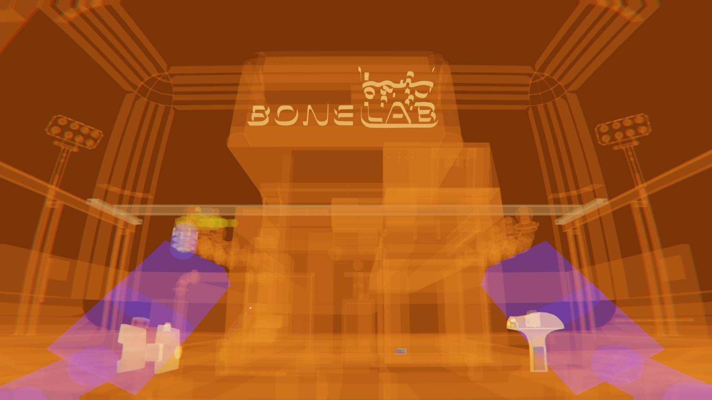

Shows the shape of physical colliders and hitboxes. Kinda like X-ray vision.

> [DOWNLOAD](https://github.com/jakzo/SlzSpeedrunTools/releases?q=ColliderScope)

## Caveats

- Note that by default it only watches for changes to colliders which are part of the player rig and very slowly watches for changes to others. This means that non-rig collider changes take a long time (minutes) to update. You can change this behavior by turning the `onlyResizeRigColliders` option off but this has a severe impact on performance.
- Entering a new chunk of a level causes colliders in the new chunk to quickly be visualized, however entering a previously loaded chunk will not. You will have to wait for the background checker to go through the old chunk colliders which can take several minutes.
- Switching avatars will update the colliders quickly, but the visuals will not be removed until the background checker finds them.

# Installation

- Make sure [Melon Loader](https://melonwiki.xyz/#/?id=what-is-melonloader) is installed in Bonelab
  - To install Melon Loader for Quest follow the [instructions here](https://github.com/LemonLoader/MelonLoader/wiki/Installation)
  - For PC: Patch 3 or before must use Melon Loader 0.5.x and patch 4 onwards must use 0.6.x
  - For Quest: Lemon Loader currently installs Melon Loader 0.5.x (and works with patch 4)
- Download [the mod from Github](https://github.com/jakzo/SlzSpeedrunTools/releases?q=ColliderScope)
- Open the downloaded `.zip` file and open the folder corresponding to your game and Melon Loader version
- Extract the `Mods/ColliderScope.Px.MLx.dll` file into `BONELAB/Mods/ColliderScope.Px.MLx.dll` which is usually at:
  - Steam: `C:\Program Files (x86)\Steam\steamapps\common\BONELAB\BONELAB`
  - Oculus: `C:\Program Files\Oculus\Software\Software\stress-level-zero-inc-bonelab`
  - Quest: `/sdcard/Android/data/com.StressLevelZero.BONELAB/files`

# Links

- Source code: https://github.com/jakzo/SlzSpeedrunTools/tree/main/projects/Bonelab/ColliderScope
