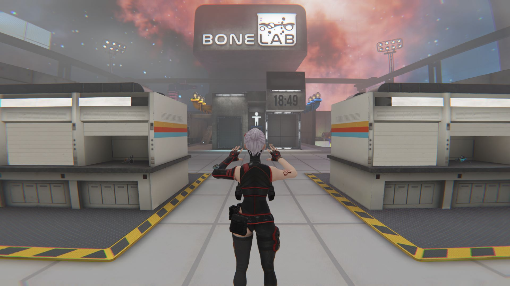

Makes spectator camera third-person.

> [DOWNLOAD](https://github.com/jakzo/SlzMods/releases?q=Bonelab+ThirdPersonCamera)

After installing this mod, switch to the spectator camera in the game preferences and it will show a third-person view in the game window.

# Installation

- Make sure [Melon Loader](https://melonwiki.xyz/#/?id=what-is-melonloader) is installed in Bonelab
  - To install Melon Loader for Quest follow the [instructions here](https://github.com/LemonLoader/MelonLoader/wiki/Installation)
  - For PC: Patch 3 or before must use Melon Loader 0.5.x and patch 4 onwards must use 0.6.x
- Download [the mod from Github](https://github.com/jakzo/SlzMods/releases?q=Bonelab+ThirdPersonCamera)
- Open the downloaded `.zip` file and open the folder corresponding to your game and Melon Loader version
- Extract the `Mods/ThirdPersonCamera.Px.MLx.dll` file into `BONELAB/Mods/ThirdPersonCamera.Px.MLx.dll` which is usually at:
  - Steam: `C:\Program Files (x86)\Steam\steamapps\common\BONELAB\BONELAB`
  - Oculus: `C:\Program Files\Oculus\Software\Software\stress-level-zero-inc-bonelab`

# Links

- Source code: https://github.com/jakzo/SlzMods/tree/main/projects/Bonelab/ThirdPersonCamera
